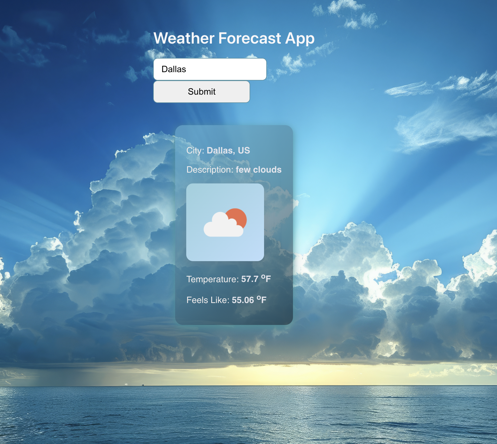
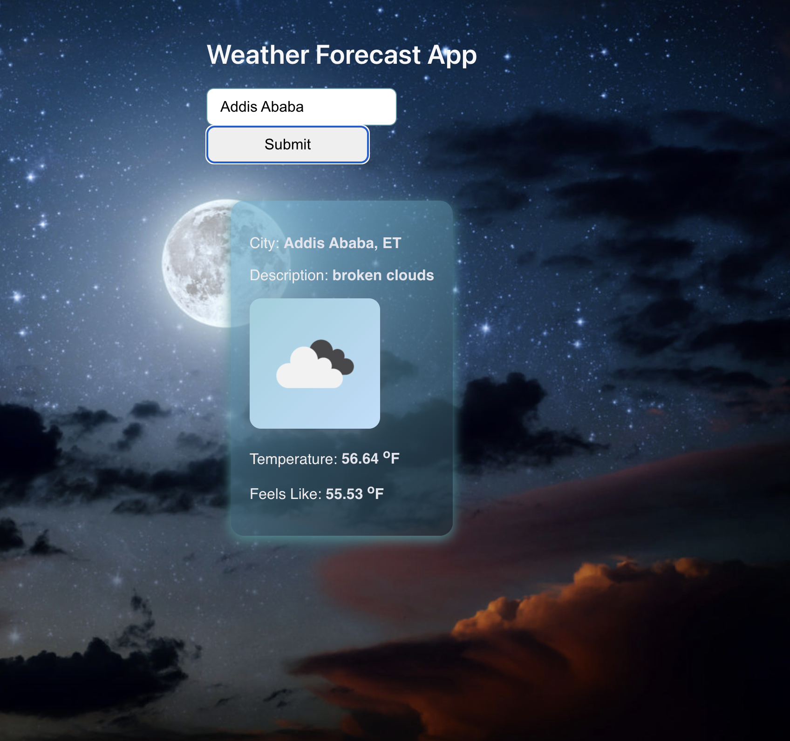

# Weather App — React + Express + OpenWeatherMap

- A minimal full‑stack weather application built with React (Vite) on the frontend and ExpressJS on the backend.
- The app fetches real‑time weather data from the [OpenWeatherMap](https://openweathermap.org/api)
  API, displays key weather details, and dynamically updates the background based on day/night conditions.

# Demo / Screenshot

DayTime

NightTime

# Project Objective

- Build a backend using ExpressJS
- Connect to a 3rd‑party API (OpenWeatherMap)
- Pass data from backend → frontend
- Render dynamic weather data in React
- Use forms and state to fetch data based on user input
- Display weather icons and responsive UI elements

# Features

- Search weather by city name
- Displays:
  - Temperature (°F)
  - Humidity
  - Wind speed
  - Weather condition icon
  - City name
  - Dynamic day/night background
- Responsive layout
- Backend proxy to hide API key
- Error handling for missing or invalid cities
